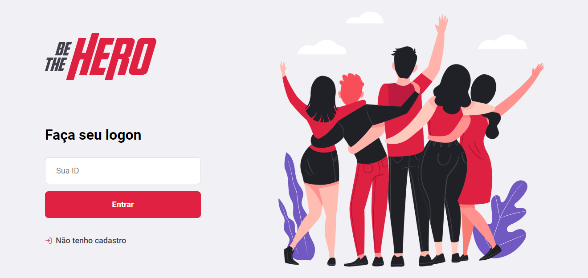
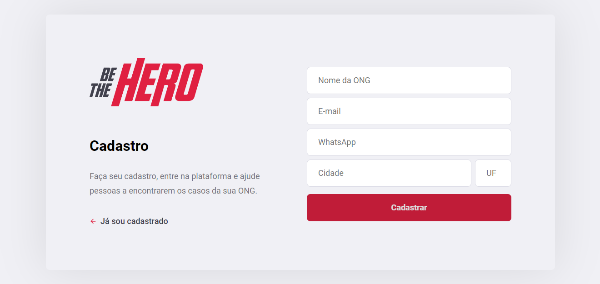
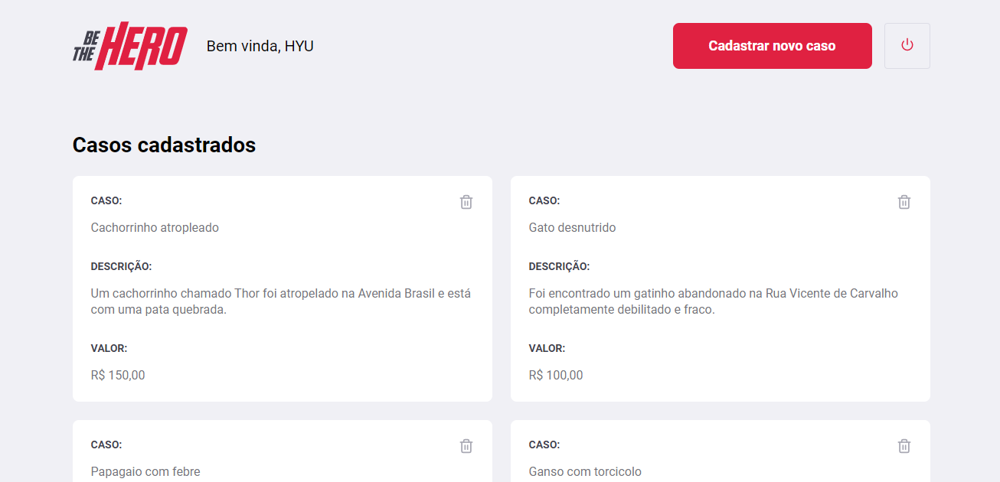
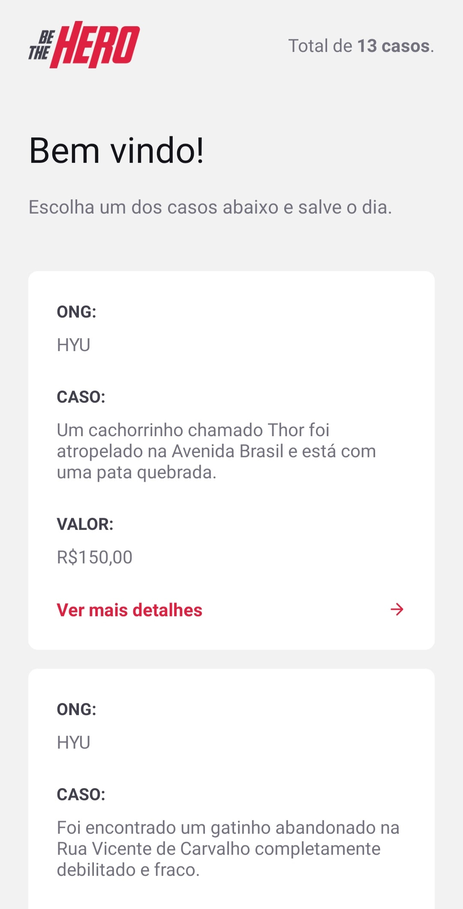
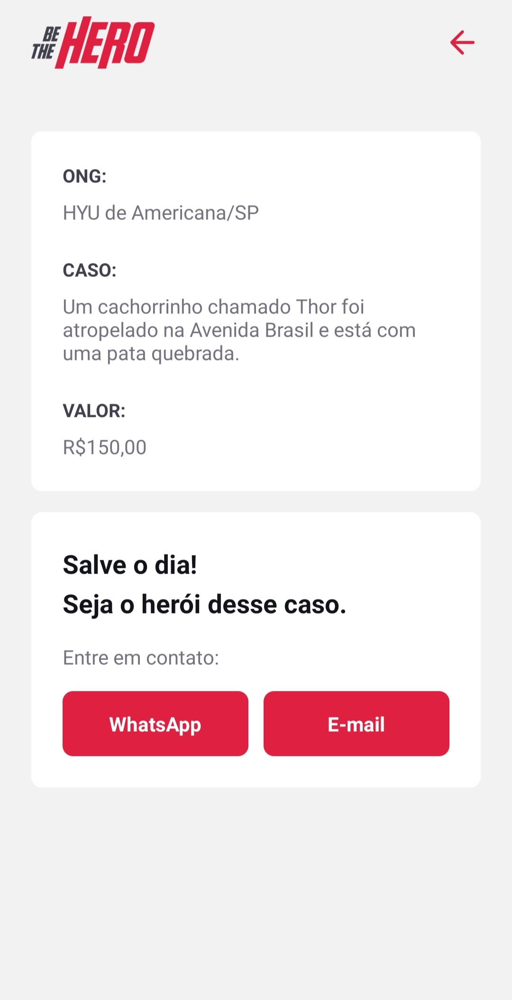

<h5 align="center">
<br>
 <b>Be The Hero - You can be the hero today!</b> 🦸‍♂️
</h5>
<p align="center">
  <a href="https://rocketseat.com.br">
    
  </a>
  
</p>

<br/>

## :eyeglasses: How was it?



<!-- Mobile -->
<div style="display:flex;justify-content:space-around;">
 
 
 
</div>


## :star2: Technologies
This project was built with:
- [Node.js](https://nodejs.org/en/)
- [React](https://reactjs.org)
- [React Native](https://facebook.github.io/react-native/)
- [Expo](https://expo.io/)
- [SQLite](https://www.sqlite.org/index.html)

## 📖 About this project
This project was developed to help NGOs to find heroes who can contribute with some value in their cases.<br/>
In the [web application](./frontend/), the NGO can register a new case, defining the title, description and the expected value to help in the case.<br/>
In the [mobile application](./mobile/), the user can view all cases, as well as view a specific case and send an email and / or message to the NGO.

## :seedling: How to contribute
 - Fork this repository;
 - Create a branch with your feature: ```git checkout -b my-feature```
 - Commit your changes: ```git commit -m 'feat: My new feature'```
 - Push your branch: ```git push origin my-feature```

## :memo: License
This project is under the MIT license. Take a look at the [LICENSE](LICENSE.md) file for more details.


